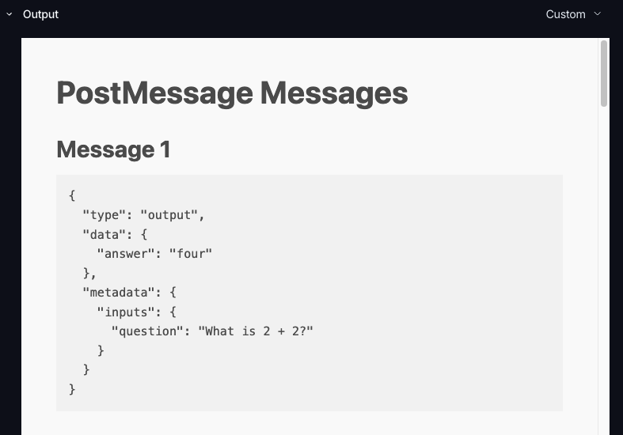
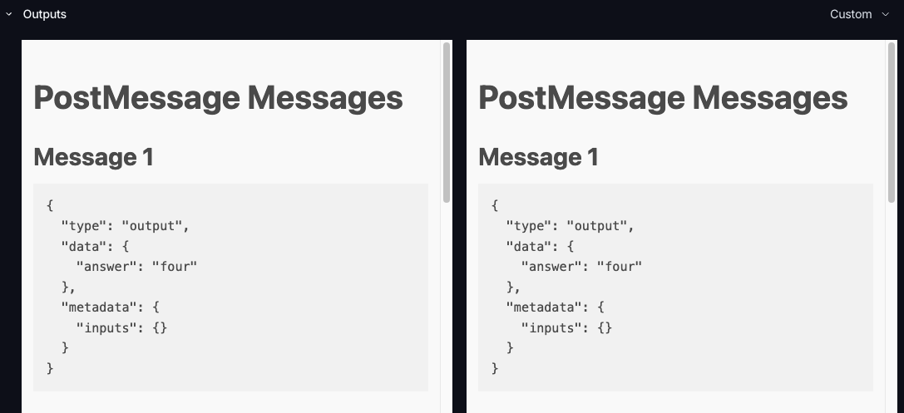
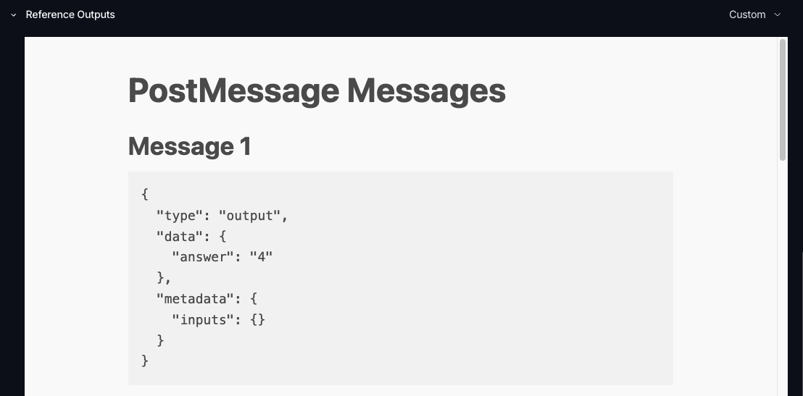
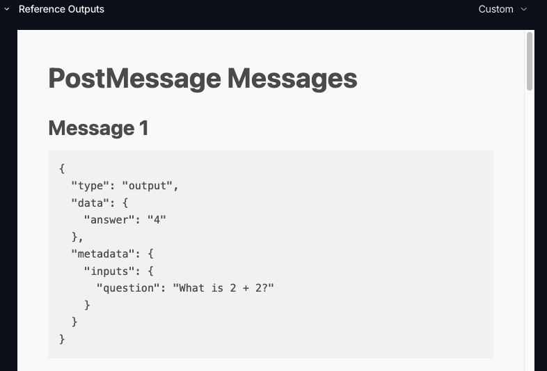

# LangSmith custom output renderer: echo repro

The [custom output rendering docs](https://docs.langchain.com/langsmith/custom-output-rendering)'
own example page (`index.html`, unchanged) as a dataset's renderer. It prints every message
LangSmith posts, so you can compare what each experiment view sends.

## Run it

Needs [mise](https://mise.jdx.dev) (it installs `cloudflared` and `uv`) and a LangSmith API key.

```sh
mise install
echo "LANGSMITH_API_KEY=lsv2_..." > .env
mise exec -- ./run.sh
```

`run.sh` serves `index.html` on localhost, opens a Cloudflare quick tunnel to it (LangSmith
embeds only `https://` pages), then runs `repro.py`. That creates a `renderer-echo-repro`
dataset with one example, sets its custom output renderer to the tunnel URL, runs two
experiments and prints the URLs of the three views to check. The tunnel stays up until
Ctrl-C; its URL changes on every run, and `repro.py` re-points the dataset each time.

## Check

1. **Trace view:** open it and switch Output to Custom. (The standalone run page offers no
   Custom format: the dataset's renderer applies only inside the dataset's pages.)
2. **Compare pane:** open it, expand the row, switch Outputs and Reference Outputs to Custom.
3. **Single experiment:** open it, click the row, switch Reference Outputs to Custom.

Per the docs, each message is `{type: "output" | "reference", data, metadata: {inputs}}`,
with `metadata.inputs` holding the example's inputs (`{"question": "What is 2 + 2?"}`) and
`type` telling a run's outputs from the reference outputs.

## Results

Run's outputs are `{"answer": "four"}`; the reference output is `{"answer": "4"}`.

| Where | `type` | `metadata.inputs` | Per the docs? |
|---|---|---|---|
| Trace view → Output | `"output"` | `{"question": "What is 2 + 2?"}` | Yes |
| Compare pane → Outputs | `"output"` | `{}` | No: inputs missing |
| Compare pane → Reference Outputs | `"output"` | `{}` | No: wrong type, inputs missing |
| Single experiment → Reference Outputs | `"output"` | `{"question": "What is 2 + 2?"}` | No: wrong type |

Two bugs. The reference section labels its data `"output"` in both experiment views. The
compare pane also sends empty inputs.

A renderer that needs the inputs, or tells outputs from references by `type`, can't draw
the compare pane.

| Trace view | Compare pane: Outputs | Compare pane: Reference Outputs | Single experiment: Reference Outputs |
|---|---|---|---|
|  |  |  |  |
